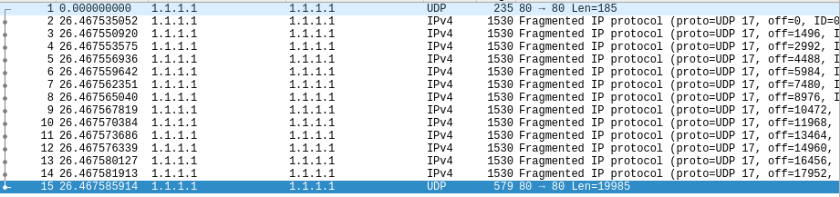
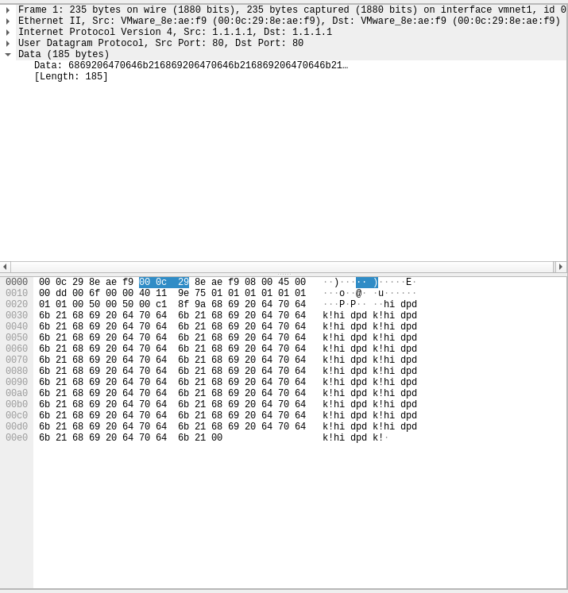
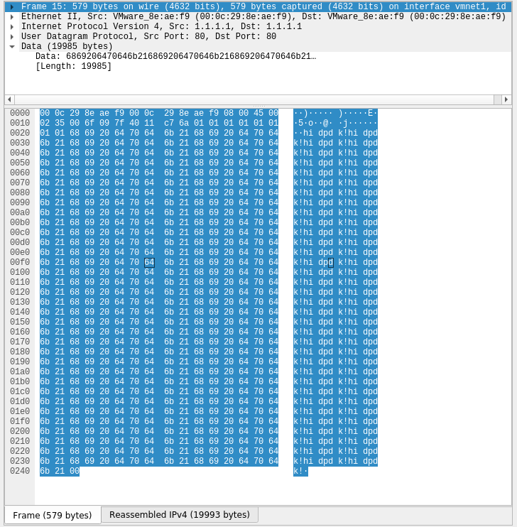

**Q1**:  
一个2M的大页相比4K的页，可以在一条TLB映射更多的虚拟地址，减少TLBmiss，较少访存的时间。  
缺点是使用的连续内存较大，较为浪费物理内存。  
**Q2**:  
首先主线程调用rte_eal_init初始化。主线程然后调用*RTE_LCORE_FOREACH_WORKER*宏，遍历每一个逻辑核，调用 *rte_eal_remote_launch* 在这个核上开启从线程，执行lcore_hello。然后主线程自己也执行lcore_hello。然后主线程调用	*rte_eal_mp_wait_lcore* 等待从线程运行完毕，最后返回。  
**Q3**: 
1. rte_eth_tx_burst(port_id, queue_id, tx_pkts, nb_pkts)批量发送包  
   port_id 为发包的接口号，queue_id  为发送队列的id。tx_pkts 为一个指向 *struct rte_mbuf* 的指针数组，用于存放接收包的内容，nb_pkts为tx_pkts向量的长度。返回值为实际发送包的数量。该函数会释放已经发送的mbuf的内存。  
2. rte_eth_tx_burst 和tx_burst相似，用来接收包。  

**Q4**:  
rte_mbuf是用于放网络包的缓存。  
它通过mem_pool中获得，大小总数等参数在初始化mem_pool时设置。  
rte_mbuf头部有两个缓存行大小的元数据，用来保存mbuf的数据，包括源池，next指针等  
然后是headroom长的空白，然后是数据头指针，数据尾指针指向的初始位置，后面全是tailroom。  
需要放置网络包时，需要通过append,alloc,trim，adj等函数改变rte_buf的位置，确认成功后才能复制数据。  
超过一个mbuf长度的数据可以写在另一个mbuf中，并用chain函数链接起来，这会设置元数据中的next。可以通过pkt_len获取被链接起来的总数据大小  
rte_eth_tx_burst 会自动free发送成功的mbuf，其他情况需要通过free函数手动释放。  

用gen_data产生测试数据，为连续的"hi dpdk!"，最后一个为"\0"  
  
  
  
包的长度小于一个MTU，data中为测试数据，外部是一个udp包头，一个ipv4包头和一个ether包头。  
ipv4的checksum为ip包头的checksum，udp的checksum为ip的地址加udp包头加数据的checksum。  
只用了一个mbuf，因为它比MTU大  
对于较长的数据，ip层会fregmentation，ip里的offset和flag用于标记顺序  

可以目测结果是正确的。 
