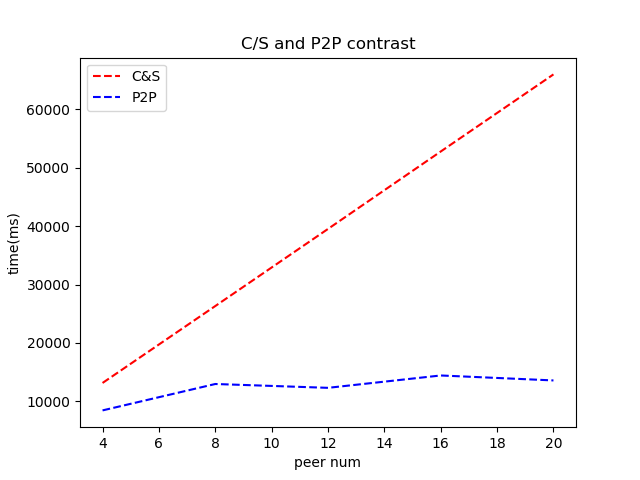

# report of socket programming
<br/>

## how to run
in the directory 'C&S', change peerN in 'demo.py'.  
in the directory 'P2P', change peerN in 'demo.py' and 'util.h'  
type following command in terminal to run in mininet:
```
make
demo python ./demo.py
```
and run the following command to print the time of the whole process
```
python ../timeMinus.py time.txt
``` 
and following command can remove unused file
```
make clean
```
after the execution all the experiment and write the data in 'chartData.xls', following command in the root directory can be used to show the chart.
```
python ./chart.py
```
<br/>

## evalution result
  
I use 'test.txt' as the transmission file, which is about **393.6 KB**. And in 'demo.py', I set the bandwidth as **1Mb/s**. I test the two model for 5 different peer number, from 4 peers to 20 peers. Every peer number test 2 time to get the average. I find C/S model increases as a linear scale when the peer number increases. But P2P model stays almost the same in total time when the peer number increases. This is consistent with the theory.
## my design
1. In C/S model, I let the server in the loop to **accept** the request. When the client **connect** to the server, the server new a peer thread to handle the request. It use a fixed size buffer to copy the file to the file that socket opens.  
   The client just **connect** to the server and read from the socket file. And it save the content in current directory named as the "receive'X'.txt" where X is the parameter from the command line.
2. In P2P model, the server is simpler. It read the peer number from 'untl.h' and decides how many part it should seperate the file. Then it open the listen fd. When it **accept** a client, it register client's ip and the offset of the part it would send to the client in 'tracer.txt'. Then it also new a thread to write the seperated part in socket file like the action in C/S model.  But before the file content, the server will also transmit the header which is composed of offset of the part and how many byte it sends.
   The client may be more complex. It first **connect** to server to get its initial part. The header of socket file helps the client to save the content in correct position. Then it new a thread 'send' to send the initial part to others. The parent thread is responsible to 'request' other's initial part. The 'send' thread acts like the server in C/S model except for the extra header and the fixed number of handle the request(peer number -1). The 'request' thread read the 'tracer.txt', open a different port and send request to the specific ip for specific part. Then it save the content in the right position with the help of header. After peer number -1 iterations, the file is complete and request is ended.
3. To get the evaluation result, I write a helper function 'setTime.h' which will save the time in 'time.txt' in ms with the given prefix. Then the timeMinus.py will read time.txt and get the minus of the latest end and the earliest start. In C/S model, 'start' is set in every client try to connect to the server and 'end' is set in their finish moment. In P2P model, 'start' is set when server sends its first file part and end is set in every 'send' and 'request' thread of client.
4. In 'demo.py', I generate the mininet cmd in 'cmd.sh' automatically. Then it can be executed in 'CLI()' with the script parameter.
<br/>

## something else
1. In this lab, I get familiar to the simple socket programmering. I handle the socket file by using **fdopen** instead of **write** and **read** directly because the latter buffer can improve the performance.
2. I also learn a lot about multi-thread programming. It involves a lot about the asynchronous problem between process and threads. For example, when one client process want to request other's part in P2P, but no one else has registered itself in tracer.txt, the process should sleep for a short time and scan the file again. Between threads, the parameter the parent transfered should be allocate in heap to avoid data racing. Most thread should use **detach** function to automatically free after exit. But in P2P's 'sender' thread, every 'senderToOne' is given the same pointer to the init part in heap, so 'send' should explicitly **join** the peer thread and free the pointer. Mutex is also helpful to protect global variable.
3. I also learn the multiply api of IO in C. For example, when a file wanted to be edited at any position, the parameter 'rb+' should be added instead of 'ab' which will ignore the **fseek** operatioin.
4. I also learn some debug skill of gdb. By using *set scheduler-locking on* in gdb CLI, I can debug in a specific thread and pause others, which helps me a lot to identify the error.

518021911058 *沈瑜石*
